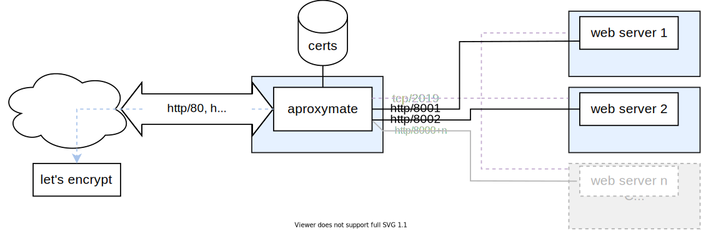

# aproxymate

Aproxymate is a caddy reverse-proxy container. The template can be used to add dockerized webservers behind it.

## Getting started

1. Use `docker-compose.template.yml` to create your own `docker-compose.yml` in your dockerized web project.
2. Disable https. Especially http to https redirection
3. Change the webservers port from 80 to another (usually >8000)
4. Fill in this port in the `caddy.reverse_proxy` label so the reverse proxy can connect it
5. `docker-compose up` both projects

## License

Licensed under GPLv3 (C) 2020 Raphael Pour
